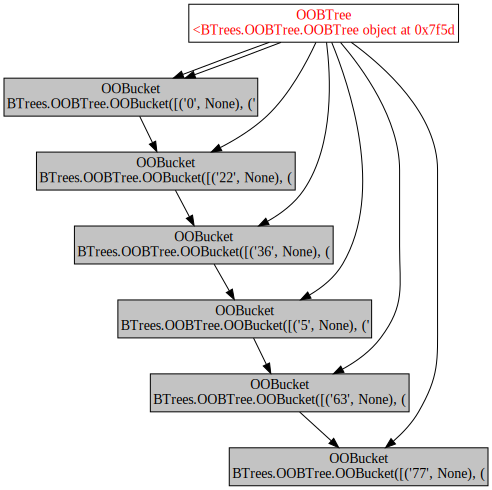
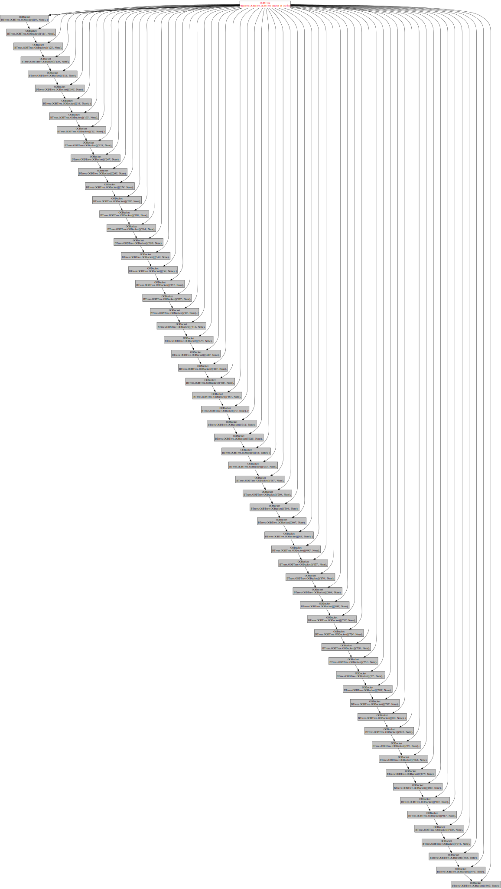

# Debugging stack overflow errors when copying large collections with zope.copy

The error showed up while using zope.copy on a BTreeContainer subclass
containing over 9000 EmailMessage objects, which are simple objects inheriting
from Persistent and Contained, with only string attributes.

The error was RuntimeError: maximum recursion depth exceeded

Run tox to reproduce the problem.

This is filed as https://github.com/zopefoundation/zope.copy/issues/8.

## Details

Python's stdlib pickle works recursively and can't handle larger BTrees.

An OOBTree with a hundred items loks like this:



An OOBTree with a thousand items loks like this:



This is all very linear: a linked list of buckets, each with about 20 items.

An 8000-item btree has about 400 buckets?  504 actually:

```
>>> from BTrees.OOBTree import OOBTree
>>> tree = OOBTree({str(n): None for n in range(8000)})
>>> import objgraph
>>> objgraph.count('OOBucket')
504
```

500 is a suspicious number, given that the default sys.getrecursionlimit() is
1000.  Two stack frames per object, and a depth-first traversal will fail.
